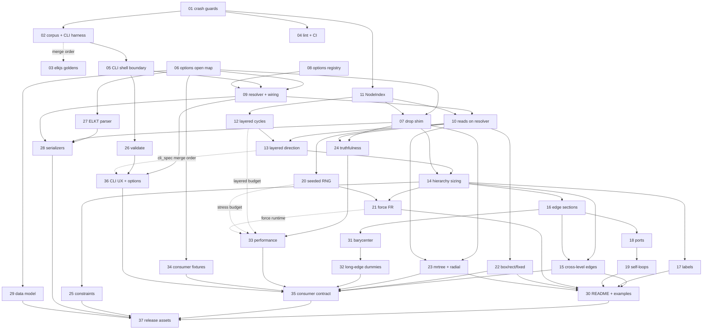
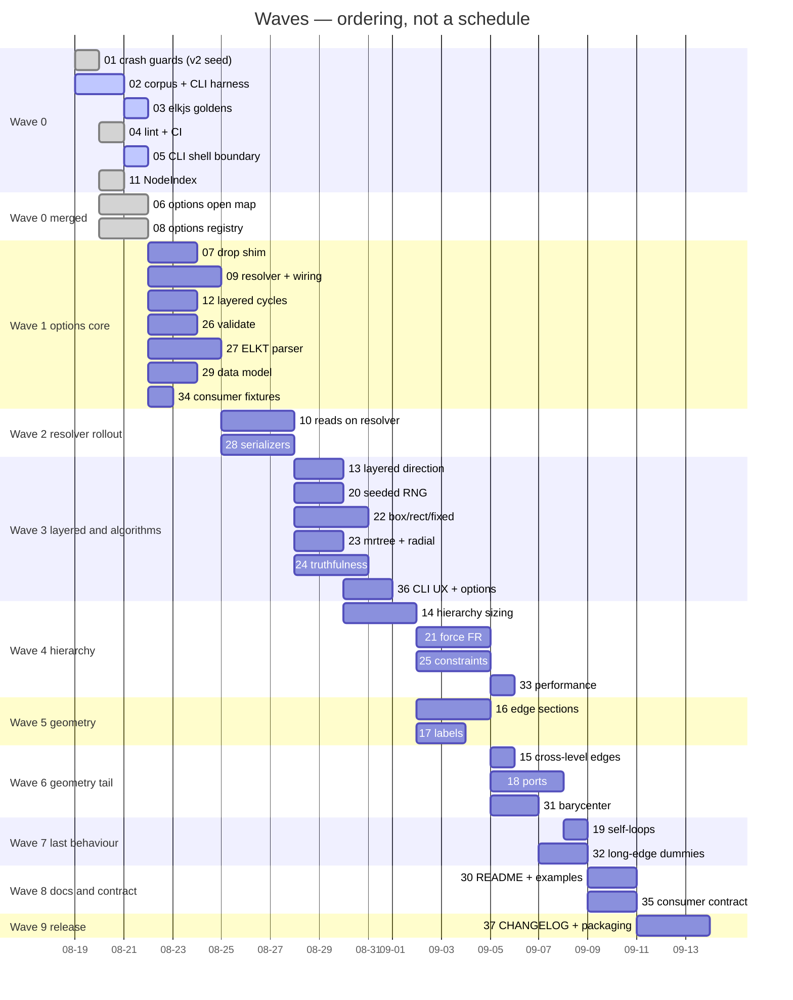

# 00 — elkrb remediation overview

**Date**: 2026-08-21. Base branch `v2` = `main` + item 01, seeded at
`a008889`. This effort takes elkrb from a gem that crashes on ordinary
ELK input to one a consumer can adopt. **Done means:** any ELK
JSON / YAML / Ruby Hash — README shapes, `spec/fixtures/*.json`, both
`imported_tests.json` corpora — runs through `Elkrb.layout` and
`elkrb layout` end to end without crashing; every `layoutOptions` key at
every level survives the round trip and is echoed back like elkjs; one
resolver with one precedence rule feeds every algorithm; every option a
consumer sends is either honoured or visibly reported as
accepted-not-honoured (registry status plus one logger warning), never
silently dropped; coordinates follow ELK conventions (owner-relative
labels, sections clipped to node borders, bottom-up compound sizing,
layered RIGHT/20/20/12); the returned graph is the user's graph, with no
reversed edges and no scratch keys; the CLI is shell-safe with correct
exit codes and streams; `docs/OPTIONS.adoc` is generated from the same
`Elkrb::Options::Registry` the code reads, so docs cannot drift; and the
consumer-contract fixtures captured from claricle/sirena (items 34 and
35) are the acceptance test. The release is 2.0.0.

## Where this came from

A two-pass audit of `6ac367c` (v1.0.2) produced **272 verified findings**
— 12 Blocker, 72 High, 127 Medium, 52 Low, 9 Info — grouped into 16 root
causes RC1–RC16. Pass 1 ran 12 finder agents with a verifier behind each
one: 303 raw findings, 250 confirmed, 0 refuted. Pass 2 re-verified the
34 findings whose verifier batch had died (all 34 confirmed) and put all
97 Blocker/High findings through a refute-biased skeptic told to knock
them down: 97 reproduced, 0 refuted, 12 downgraded.

The findings file itself is a local working doc and is not committed.
Nothing here requires it. Every item's `## Facts` restates what that item
needs with its own evidence — a repro command or a `file:line` — and
carries the finding ids in parentheses so a claim can be traced if the
working doc is at hand.

## Track topology

Solid arrows are start blockers. Dotted arrows are partial: the item may
start, but cannot close until the source lands. Transitive edges are
omitted — 14 waits on 13, which waits on 10, so 10 → 14 is not drawn.
The items table below is the authoritative "can start" list.

Two harness items sit behind almost everything and are not drawn,
because 30-odd arrows into one node hide the shape:

- **02 gates the CLOSE of every execution-diff-gated item from 05 on.**
  `bundle exec rake "corpus:dump[<dir>]"` is the sole XD driver. A build
  may start earlier by materialising the driver from
  `fix/s0b-corpus-cli-harness` uncommitted.

  The gate was supposed not to have that licence. In practice 06, 08
  and 11 all gated against the materialised driver and merged ahead of
  02, so this is a convention already bent three times rather than a
  constraint the repo enforces. Treat it as the target state, and note
  that three merged items were gated without 02 in their base.
- **03 gates every item that un-pends a golden** — 12, 13, 14, 16, 17,
  18, 19, 20, 21, 22, 23, 31. Item 03's own header calls this a start
  block; those items phrase it as "the golden assertions need 03". **03
  is built but not merged**, so this block is live: none of those twelve
  items can start until it lands.

Item 04 blocks nothing structurally. It moves the bar instead: from 04
on, "green" means `bundle exec rake` (spec **and** rubocop), not
`bundle exec rspec`. Every item from 05 onward reports against that bar.

Two pairs read out of numeric order, and that is deliberate — the
numbering follows the whole effort's dependency order, not any one
item's. 15 waits on 16. 35 waits on 36.

**Critical path:** 02 → 05 → 09 → 10 → 13 → 14 → 16 → 18 → 19 → 30 → 37.
Everything else hangs off 09/10 or off 06/05 directly.

## Waves

Bars are ordering and relative size. No dates are promised beyond wave 0,
which already happened.

## Items

Size includes specs and excludes generated JSON. "Blocks" names starts
unless it says close.

| # | Item | Slice | Size | Can start | Blocks | Status |
|---|---|---|---|---|---|---|
| 01 | Crash guards on ordinary ELK input | S1 | medium | closed | is the `v2` base of everything; 02, 03 | **merged** @ `a008889`; PR #2 still open, 2 Highs |
| 02 | Corpus and CLI harness | S0b | medium | now | 05; close of 03, and of every **remaining** XD-gated item from 05 on — 06, 08 and 11 already gated against the driver materialised uncommitted and merged ahead of it | built @ `37bb0ce`, **1 open Blocker** |
| 03 | elkjs golden harness | S0a | large | now; closes after 02 | close of 24; start of 12, 13, 14, 16–23, 31 | built @ `e8c7e69`, not gated |
| 04 | Lint and CI hygiene | S28 | small | closed | nothing; moves the bar to `rake` | **merged** @ `56900d3`, PR #6 |
| 05 | CLI and shell boundary | S2 | medium | after 02 | 09, 26, 36 | built @ `249a4d8`, not gated — **critical path** |
| 06 | LayoutOptions open map | S3 | medium | closed | 07, 09, 27, 29, 34 | **merged** @ `36e0eb1`, PR #4 |
| 07 | Drop the LayoutOptions shim | S3b | medium | **now** | must merge before 14, 16, 17, 19, 23, 24, 28, 30 start | ready — 06 and 11 are merged |
| 08 | Options registry | S4 | medium | closed | 09, 36 | **merged** @ `1c0abca`, PR #7 |
| 09 | Resolver, wiring, precedence, CLI flags | S5 | large | after 05 | 10, 13, 14, 25, 28, 35, 36 | blocked by 05 only |
| 10 | Every remaining option read onto the resolver | S6 | large | after 09, 11 | 13, 14, 16, 17, 18, 20, 22, 23, 24, 35 | blocked by 09 |
| 11 | NodeIndex: endpoints, duplicate ids, disco | S7 | medium | closed | 07, 10, 12, 14, 16, 20, 23, 24 | **merged** @ `4364739`, PR #5 |
| 12 | Layered: internal cycle breaking, hyperedges raise | S8 | medium | after 11, 03 | 13, 25; close of 33 | blocked by 03 |
| 13 | Layered: direction, ELK spacing, centring | S9 | small | after 09, 10, 12, 03 | 14, 16, 31; merges before 36 touches `cli_spec` | blocked by 10, 12 |
| 14 | Hierarchy: bottom-up sizing, per-level routing | S10 | large | after 07, 09, 10, 11, 13, 03 | 15, 16, 17, 21, 25 | blocked by 13, 07 |
| 15 | Cross-level edge routing | S10b | small | after 14, 16 | 30, 35 | blocked by 16 |
| 16 | Edge sections: borders, ids, shapes, ORTHOGONAL | S11 | medium | after 07, 10, 11, 13, 14, 03 | 15, 18, 19, 31 | blocked by 14 |
| 17 | Labels owner-relative | S12 | medium | after 07, 10, 14, 03 | 30 | blocked by 14 |
| 18 | Ports | S13 | medium | after 10, 16, 03 | 19 | blocked by 16 |
| 19 | Self-loops | S13b | small | after 07, 16, 18, 03 | 30 | blocked by 18 |
| 20 | Seeded RNG, stress edge length, random | S14 | medium | after 10, 11, 03 | 21; close of 33 | blocked by 10 |
| 21 | Force rewrite (Fruchterman–Reingold) | S15 | medium–large | after 14, 20, 03 | 30; close of 33 | blocked by 14, 20 |
| 22 | Box, rectpacking, fixed | S16 | medium–large | after 10, 03 | 30, 35 | blocked by 10 |
| 23 | mrtree and radial | S17 | medium | after 07, 10, 11, 03 | 30, 35 | blocked by 07, 10 |
| 24 | Truthfulness: disco, libavoid, vertiflex, spore, topdown | S18 | medium–large | after 07, 10, 11; closes after 03 | 33 | blocked by 07, 10 |
| 25 | Constraints | S19 | medium | after 09, 12, 14 | 37 | blocked by 14 |
| 26 | `validate` correctness | S20 | medium | after 05 | 36 | blocked by 05 |
| 27 | ELKT parser rewrite | S21 | large | **now** | 28 | ready — 06 is merged |
| 28 | ELKT and DOT serializers | S22 | large | after 07, 09, 27 | 37 | blocked by 27, 09, 07 |
| 29 | Data-model completeness | S23 | medium | **now** | 37 | ready — 06 is merged |
| 30 | README and examples | S24 | medium | after 06–23 merged | 37 | blocked by 15, 17, 19, 21, 22, 23 |
| 31 | Layered: barycenter crossing minimisation | S25a | medium | after 13, 16, 03 | 32, 35 | blocked by 16 |
| 32 | Layered: long-edge dummies | S25b | medium | after 31 | 35, 37 | blocked by 31 |
| 33 | Performance leftovers | S26 | small | after 24; closes after 12, 20, 21 | 35, 37 | blocked by 24 |
| 34 | Consumer fixtures: capture | S27a | small | **now** | 35, which reads its fixtures | ready — 06 is merged |
| 35 | Consumer contract: acceptance | S27b | small | after 09, 10, 13, 14, 15, 16, 22, 23, 31, 32, 33, 34, 36 merged; reads 34's fixtures | 37 | blocked by 15, 22, 23, 32, 33, 34, 36 |
| 36 | CLI UX and option introspection | S29 | medium | after 05, 08, 09, 26 | 35, 37 | blocked by 09, 26 |
| 37 | CHANGELOG, generated docs, packaging | S30 | medium | after 25, 28, 29, 30, 32, 33, 35, 36 | nothing; the `v2 → main` PR follows | blocked by 25, 28, 29, 30, 35 |

Ready to pick up today, branching straight from `origin/v2`:
**07**, **27**, **29** and **34**. Every blocker of theirs is merged.

Two that look ready and are not:

- **12** needs 03, which is built but not merged. 03 gates the start of
  12, 13, 14, 16, 17, 18, 19, 20, 21, 22, 23 and 31.
- **26** needs 05, which is built but not merged.

Three built branches are still unmerged: **02**, **03** and **05**. Gate
A and Gate B both ran on each of them at an earlier SHA. Every one has
since moved, so **no current tip carries a valid approval** — an approval
names a SHA, and a new commit invalidates it. 02 also has an open
Blocker (see its card).

Clearing **05** is the highest-value move on the board. Counted from the
dependency columns above, **24 of the 29 unstarted cards are blocked
behind it**, through 09 and then 10. Nothing else on the list moves that
many.

## Rulings

All 16 were ruled by the maintainer on 2026-08-19. They are settled.
Nothing below is re-decided inside an item; an item that disagrees with a
ruling is wrong.

| # | Question | Ruling | Why |
|---|---|---|---|
| 1 | Option precedence | ELK-faithful: element `layoutOptions` > element `properties` > call options > registry default; explicitly given CLI flags are written onto the root | elkjs behaves that way, and the README's primary pattern is graph-carried options |
| 2 | Release | The breaking batch ships as 2.0.0, one CHANGELOG migration block, no compatibility toggles; the bump happens at release time | one break, one migration to read |
| 3 | LayoutOptions shape | `attribute :layout_options, :hash` open map; the `::Hash`-subclass shim is deprecated in 06 and deleted in 07 | a typed class cannot retain unknown `elk.*` keys |
| 4 | `sig/` | Deleted in 37, along with the `rbs` dependency | no owned source of truth and no CI validation |
| 5 | Sizeless nodes | Leaf nodes that arrived without a size keep omitting `width`/`height`; nodes with children always get a computed size | elkjs behaviour; the invariant exempts compounds |
| 6 | elkjs reference | 0.11.0, pinned | the README's target; a bump is a separately reviewed rebaseline |
| 7 | Layered fan-out parity | Structural tier; Brandes-Köpf and network simplex deferred | over 400 lines each, their own plan |
| 8 | `golden.yml` | Owned by 03; runs the committed goldens with a plain `bundle install` | CI must never need Node, npm or the network |
| 9 | Bare `direction` | A registered alias of `elk.direction`, honoured everywhere it is; `--direction` on all three commands | the Ruby consumers drive elkrb with the short key; cost is one registry row |
| 10 | Hyperedges in layered | Raise `UnsupportedConfigurationException` | ELK and elkjs do; splitting internally is not semantics-preserving |
| 11 | Hyperedges elsewhere | Per algorithm, follow the elkjs golden; elkrb-only algorithms raise | match the reference wherever one exists |
| 12 | Nested `elk.algorithm` | Honoured — registry dispatch per compound; an unknown pin raises `AlgorithmNotFoundError` | ELK `SEPARATE_CHILDREN`; a silent fallback hides a typo |
| 13 | Ruby floor | `>= 3.2`, set in 37 | lutaml-model 0.8.19 already requires it |
| 14 | `elk.hierarchyHandling: INCLUDE_CHILDREN` | Partial: flat graphs equal SEPARATE_CHILDREN; nested graphs get cross-level edges routed in the container frame (item 15); no cross-level layering | covers sirena's C4 relationships without a layered rewrite |
| 15 | Slice-1 coordination | `v2` is seeded at 01's head `a008889` and frozen; PR #2 keeps base `main` and is merged forward | `v2` is never rewritten |
| 16 | Integration branch | `v2`; every slice PR targets it; one `v2 → main` PR at the end | `main` only moves through maintainer-approved merges |

## Breaking changes for 2.0.0

The CHANGELOG is assembled by item 37 from the merged PRs' `## Breaking`
sections — that inventory is the source, not this list. No item edits
`CHANGELOG.md` itself.

| Item | What breaks | Migration |
|---|---|---|
| 06 | `layoutOptions` is echoed flat; the `layoutOptions.properties` nesting is gone; typed getters and setters are gone; the snake `layout_options:` Hash key is dropped | move keys up one level, use ELK ids, index with `[]` |
| 07 | `Elkrb::Graph::LayoutOptions` no longer exists | pass a plain string-keyed Hash |
| 09 | A graph's `elk.algorithm` pin beats the `algorithm:` kwarg and the old Thor `--algorithm` default | pin on the graph to force an algorithm |
| 11 | A duplicate node or port id within one level raises `Elkrb::ValidationError` | make ids unique per level; they may still repeat across levels |
| 12 | Layered raises `UnsupportedConfigurationException` for an edge with more than one source or target; `properties["reversed"]` is never written | split hyperedges yourself; find back edges from your own input |
| 13 | Layered defaults to RIGHT with a 20px layer gap; every layered coordinate moves | `"elk.direction":"DOWN"` and `"elk.layered.spacing.nodeNodeBetweenLayers":60` |
| 14 | The `hierarchical` option is a no-op; declared compound sizes are recomputed from children; an unknown nested pin raises `AlgorithmNotFoundError` | drop the option; stop declaring compound sizes |
| 16 | Edge endpoints move from centres to borders; section ids `_section_0` → `_s0`; sections gain `incomingShape`/`outgoingShape` | renderers that clipped centre-based lines stop doing so |
| 17 | Label coordinates become owner-relative; default node labels stop being centred | add the owner's x/y when drawing; `"elk.nodeLabels.placement":"[H_CENTER,V_CENTER,INSIDE]"` keeps them centred |
| 18 | Ports stop emitting `index: -1`, `offset: 0.0` and `side: "UNDEFINED"` unless set; a ported edge anchors on the port's outer border; FIXED_POS ports stop moving | read the keys you set, not the defaults |
| 19 | Self-loop section ids `_section_0` → `_s0`; loop geometry moves onto the node border; a port-to-port edge on one node is now a loop | none beyond the id |
| 22 | `fixed` stops translating to the padding origin and honours `elk.position`/`elk.bendPoints`; box coordinates move to ELK's packing | pre-position in final coordinates |
| 23 | mrtree and radial coordinates move to the ELK shape; mrtree honours `elk.direction`; radial reads edges and centres the root | none; the old numbers were wrong |
| 25 | `_constraint_*` and `_assigned_layer` scratch keys leave output `properties`; violations go through `Elkrb.logger`; a layer constraint actually moves the node | stop reading the scratch keys |
| 31 | Layered node order within a layer follows a barycenter sweep, so cross-axis coordinates move | `"elk.layered.crossingMinimization.strategy":"NONE"` restores insertion order |
| 32 | Edges spanning more than one layer carry bend points and route around intervening nodes | none; the old output drew lines through node boxes |
| 37 | Ruby floor `>= 3.2`; `sig/` and the `rbs` dependency deleted; `spec.files` becomes an explicit whitelist | upgrade Ruby; do not depend on shipped RBS |

Reported in the PR body but not on the plan's carrier list — the
maintainer decides whether each enters the 2.0.0 block:

- **05** — CLI exit codes and streams change; the absolute-path fallback
  for `dot` is gone.
- **20, 21, 24** — every force, stress and random coordinate changes and
  becomes reproducible; topdownpacking stops discarding declared sizes;
  libavoid stops moving positioned nodes.
- **26** — `validate` exit codes, messages and output stream all change.
- **27** — unparseable input raises `Elkrb::ParseError` where it used to
  yield an empty graph and exit 0.
- **28** — ELKT and DOT text both change shape.
- **29** — output gains `junctionPoints`, `container`,
  `incomingSections`/`outgoingSections` and label `properties` when the
  input carried them; legacy `source`/`target` is rewritten to
  `sources`/`targets`.

## How work is delivered

One branch per item, off `v2`. Where an item's parents are built but not
merged, the orchestrator makes a local `int/<slice>` ref
(`origin/v2` plus `git merge --no-ff` of each parent tip, in order) and
the branch starts from that. The PR base is `v2` either way, with the
stack named in the body.

1. **Build.** Specs first, from JSON or Hash input through the public
   entry point, values not shapes. Every `not_to raise_error`,
   `be_an(Array)` and `>= 0` example the item touches is replaced with a
   concrete expectation or deleted with a replacement. Commit locally,
   one-line lowercase subjects, explicit paths.
2. **Implementer chain.** thermo-nuclear → dependency-contract-check
   where the item names it → execution-diff where the item names it →
   Codex → copilot-review. The XD driver is
   `bundle exec rake "corpus:dump[<dir>]"` on the branch's base ref and
   on the branch, then `diff -r` of the two dump dirs. The rake exit
   status is informational — never chain on it. Each item's `## Done
   when` lists the differences the gate is allowed to see; any other
   difference is a bug.
3. **Orchestrator gates** on the exact head SHA: Gate A
   (`multi-agent-review`), then Gate B (Codex at `ultra`, with the
   verbatim verify-before-critique instruction). **Gate B runs until it
   returns APPROVE. There is no round cap.**

   That is a maintainer ruling, 2026-08-27, and it replaces the old
   "three rounds each, then park". The old cap never held: item 06 took
   seven rounds, item 08 took six, and both merged anyway — so the rule
   was being broken rather than followed, which is worse than not having
   it.

   The evidence behind the ruling: rounds four and five have been
   finding defects that would have failed when someone ran the plan, not
   cosmetics — a criterion nothing could satisfy, a rename listed at two
   places when it touches ten, a code block using a variable it never
   assigned. Findings were still getting more serious, not less, at the
   point the old cap would have parked the work.

   What has not changed: a Codex run that errored, was killed, or
   printed no `VERDICT` is not a round. Re-run it.
4. **Publish** only when both gates approve that SHA: push, then
   `gh pr create --draft` against `v2`. The body carries `## Summary`
   bullets, the item's `## Breaking` section, and the intended
   execution-diff list.
5. **Maintainer approves by message.** Then `gh pr ready` →
   `gh pr edit --add-reviewer ronaldtse` → merge.

Hard limits: no version bumps in a branch (the cimas release workflow
owns the bump); no pushes to `main`; no force-pushes; never rebase a
branch that exists on origin — merge `origin/v2` in instead.

## Current state

`v2` is on origin at `75bdb13`. **Four slice PRs are merged into it**
— #4, #5, #6 and #7. Item 01 was seeded directly rather than merged, and
its PR #2 is still open. PR #8 is not a slice; it restored the lint
ratchet. The
suite there is **763 examples, 0 failures**, and RuboCop reports **0
offences across 120 files** — measured 2026-08-27 in the clean worktree
`~/.claude/pipeline/worktrees/elkrb/todo-remediation`, with `origin/v2`
merged in.

### Merged into `v2`

Four slice PRs (#4-#7), the 01 seed, and #8's lint ratchet. **The Items table above is the one
place merge status is recorded** — do not restate a SHA here, or the two
copies drift, which is how this section came to be wrong once already.

One thing that table cannot say: **PR #2 is still an open draft against
`main` and carries 2 open High findings**, even though its code is the `v2`
seed.

### Built and gated once, since moved, not merged

| Item | Branch | Head | Ahead of `v2` | State |
|---|---|---|---|---|
| 02 | `fix/s0b-corpus-cli-harness` | `37bb0ce` | 5 | **one open Blocker** — `prune_stale_dumps` still deletes across sibling directories when the destination is a real directory whose name contains `*`. `File.file?` reads the path literally, `Dir[]` globs it. See the card |
| 03 | `fix/s0a-golden-harness` | `e8c7e69` | 11 | step 7's `corpus_spec` reconciliation happens at merge — the file it edits arrives with 02 |
| 05 | `fix/s2-cli-shell` | `249a4d8` | 20 | **the critical path.** Base is a frozen integration ref: the `v2` seed `a008889` plus 02's **old** tip `dcec6d0`. It contains neither current `origin/v2` nor current 02, and its Rakefile is still spec-only |

Suite counts on those three branches are not carried here. Each tip has
moved since it was last measured, and a number nobody re-ran is worse
than no number.

### What that leaves

- **5 merged**, 3 built but ungated, **29 unstarted**.
- Ready today from `origin/v2`: **07, 27, 29, 34**. Not 12 — 03 gates
  its start and 03 is unmerged.
- The chain **05 → 09 → 10** is single-file and cannot be parallelised.
  Counted from the Items table's own dependency columns, transitively:

  | until this lands | cards still blocked |
  |---|---|
  | 05 | **24** |
  | 09 | 22 |
  | 10 | 19 |

  So 05 is not one card among three. It gates **24 of the 29
  unstarted cards** — 83% of what has not been touched, or 75% of the
  32 that are not yet merged.

This section used to close by saying nothing was pushed and no PR
existed except #2. Both are now false: `v2` is on origin at `75bdb13`, PRs #4-#8 are
merged (#4-#7 are the slices, #8 the lint ratchet), and PR #3 carries
this plan. What still holds is the rule — a
branch is not pushed until it has a Codex approval naming its exact tip.
